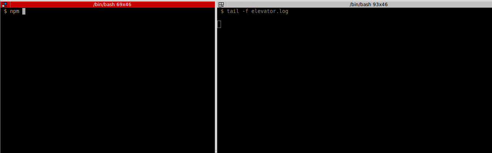

# An elevator, written in Node.js



## Dependencies

This project has been tested with the following:

* Nodejs v6.9.*

## Quick start

```shell
npm install
npm start
```

This will install all the dependencies, and start up a REPL in your terminal.
You can then issue commands to the elevator via either the insidePanel, or the
outsidePanels on each floor. For example to call the elevator to the top floor:

```javascript
outPanel7.press(d)
```

Since the elevator exists in an alternate dimension, seeing what it is actually
doing is really hard. Luckily though there is a log file available that you can
watch instead (in another terminal).

```shell
tail -f elevator.log
```

See [the test cases](TEST_CASES.md) for more examples of controlling the elevator.

## List of useful commands

```javascript
showFloor()   // Show the floor on which the elevator currently resides
insidePanel   // Dump the current insidePanel object
outPanel[1-7] // Dump one of the outsidePanel objects
u             // Shorthand for "up", for example outPanel1.press(u)
d             // Shorthand for "down", for example outPanel7.isLit(u)
.exit         // Exit
```

### insidePanel

```javascript
insidePanel.press(7) // go to 7th floor
insidePanel.isLit(7) // Show the current Lit status of the button for floor 7
```

### outPanel[1-7]

```javascript
outPanel5.press('up')   // Request to go up from floor 5
outPanel5.press(u)      // equivalent to the above
outPanel7.isLit("down") // Lit status of the "down" button for floor 7
outPanel7.press(d)      // equivalent to the above
```

## Running tests

```shell
npm test
```

## jsint

```shell
npm run jshint
```